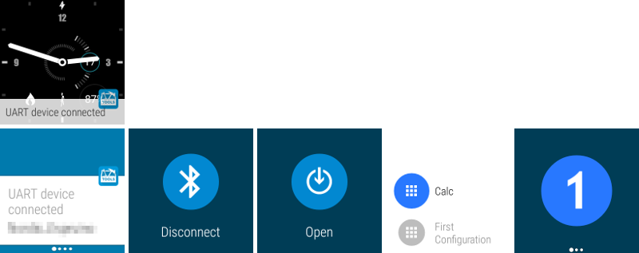
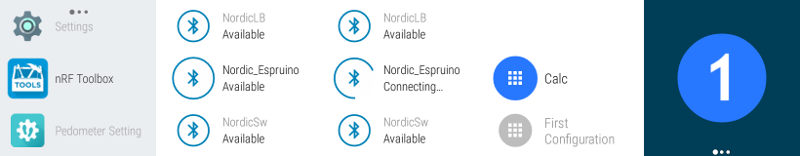

# nRF Toolbox

The nRF Toolbox is a container app that stores your Nordic Semiconductor apps for Bluetooth Smart in one location. 

It contains applications demonstrating Bluetooth Smart profiles: 
* **Cycling Speed and Cadence**, 
* **Running Speed and Cadence**, 
* **Heart Rate Monitor**, 
* **Blood Pressure Monitor**, 
* **Health Thermometer Monitor**, 
* **Glucose Monitor**,
* **Proximity Monitor**.

Since version 1.10.0 the *nRF Toolbox* also supports the **Nordic UART Service** which may be used for bidirectional text communication between devices. 

**Note:** To get a smaller version, with only the DFU profile, switch to the *only_dfu* branch.

### Nordic UART Service

The UART profile allows for fast prototyping of devices. The service itself it very simple, having just 2 characteristics, one for sending data and one for receiving. The data may be any byte array but it is very often used with just text. Each UART configuration in the nRF Toolbox consists of 9 programmable buttons. Each of them, when pressed, will send the stored command to the device. You may export your configuration to XML and share between other devices. Swipe the screen to right to show the log with all events.

Since nRF Toolbox version 1.16.0 the UART profile supports also Android Wear devices (watches). If you have an Android watch, the application will automatically be installed on it after you install or update the application on the phone. Before you start playing with the watch, please open the UART profile on the phone so it could share your configurations to all wearables.

The wearable application may work in 2 modes: as a remote control of the phone, or directly connected to a UART device.

1. Connect your phone to the UART device. After few seconds you should get a notification on the watch that your device is now connected. Swipe it left to see Disconnect button (will send a message to the phone to terminate the connection with UART target) and Open button. Click the Open button to see a list of your UART configurations. Click one and see the list of active buttons. When pressed the button will send a message to the phone using Google Play Services and the phone will send the command to the target device. In this mode you may have more than one watch connected to the phone and use both as remote controls.

    

2. Open the applications menu on Android Wear watch and click nRF Toolbox. The watch will now scan for all nearby Bluetooth Smart devices and show you them on a list. Select your UART device to connect to it. A list of your configurations will be shown, like in 1. As that was a direct connection from the watch to the UART target the phone, or any other watch will not be notified about it.

    

### Device Firmware Update

The **Device Firmware Update (DFU)** profile allows you to update the application, bootloader and/or the Soft Device image over-the-air (OTA). It is compatible with Nordic Semiconductor nRF51822 devices that have the S110 SoftDevice and bootloader enabled. From version 1.11.0 onward, the nRF Toolbox has allowed to send the required init packet. More information about the init packet may be found here: [init packet handling](https://github.com/NordicSemiconductor/nRF-Master-Control-Panel/tree/master/init%20packet%20handling).

The DFU has the following features:
- Scans for devices that are in DFU mode.
- Connects to devices in DFU mode and uploads the selected firmware (soft device, bootloader and/or application).
- Allows HEX or BIN file upload through your phone or tablet.
- Allows to update a soft device and bootloader from ZIP in one connection.
- Pause, resume, and cancel file uploads.
- Works in portrait and landscape orientation.
- Includes pre-installed examples that consist of the Bluetooth Smart heart rate service and running speed and cadence service.

#### DFU Settings

To open the DFU settings click the *Settings* button in the top toolbar when on DFU profile. 

**Packet receipt notification procedure** - This switch allows you to turn on and off the packet receipt notification procedure. During the DFU operation the phone sends 20-bytes size packets to the DFU target. It may be configured that once every N packets the phone stops sending and awaits for the Packet Receipt Notification from the device. This feature is required by Android to sync sending data with the remote device, as the callback `onCharacteristicWrite(...)` that follows calling method `gatt.writeCharacteristic(...)` is invoked when the packet is written to the outgoing queue, not when physically transmitted. With this procedure disabled it may happen that the outgoing buffer will be overloaded and the communication stops. The same error may happen when the N number is too big, about 300-400. The receipt notification ensures that the outgoing queue is empty and the DFU target received all packets successfully.

**Number of packets** - This field allows you to set the N number describe above. By default it is set to 10. Depending on the phone model, devices may send and receive different number of packets in each connection interval. Nexus 4, for instance, may send just 1 packet (and receive 3 notifications) while Nexus 5 or 6 send and receive up to 4 packets. By customizing this value you may check which value allows for the fastest transmission on your phone/tablet.

**MBR size** - This value is used only to convert HEX files into BIN files. If your packet is already in the BIN format, this value is ignored. The data from addresses lower then this value are being skipped while converting HEX to BIN. This is to prevent from sending the MBR (Master Boot Record) part from the HEX file that contains the Soft Device. The compiled Soft Device contains data that starts at address 0x0000 and contains the MBR. It is followed by the jump to address 0x1000 (default MBR size) where the Soft Device firmware starts. Only the Soft Device part must be sent over DFU.

**Keep bond information** - When upgrading the application on a bonded device the DFU bootloader may be configured to preserve some pages of the application's memory intact, so that the new application may read them. The new application must know the old data format in order to read them correctly. Our HRS DFU sample stores the Long Term Key (LTK) and the Service Attributes in two first pages. However, the DFU Bootloader, by default, clears the whole application's memory when the new application upload completes, and the bond information is lost. In order to configure the number of pages to be preserved set the **DFU_APP_DATA_RESERVED** value in the *dfu_types.h* file in the DFU bootloader code (line ~56). To preserve two pages the value should be set to 0x0800. When your DFU bootloader has been modified to keep the bond information after updating the application set the switch to ON. Otherwise the bond information will be removed from the phone.

**External MCU DFU** - The DFU service from the library, when connected to a DFU target, will check whether it is in application or in DFU bootloader mode. For DFU implementations from SDK 7.0 or newer this is done by reading the value of DFU Version characteristic. If the returned value is equal to 0x0100 (major = 0, minor = 1) it means that we are in the application mode and jump to the bootloader mode is required.

However, for DFU implementations from older SDKs, where there was no DFU Version characteristic, the service must guess. If this option is set to false (default) it will count number of device's services. If the count is equal to 3 (Generic Access, Generic Attribute, DFU Service) it will assume that it's in DFU mode. If greater than 3 - in app mode.

This guessing may not be always correct. One situation may be when the nRF chip is used to flash update on an external MCU using DFU. The DFU procedure may be implemented in the application, which may (and usually does) have more services. In such case set the value of this property to true.

### Dependencies

In order to compile the project the **DFU Library is required**. This project may be found here: https://github.com/NordicSemiconductor/Android-DFU-Library.
Since version 1.16.1 it is imported automatically from *jcenter* repository and no special configuration is needed. If you want to make some modifications in the DFU Library, please clone the DFU Library to the same root as nRF Toolbox is cloned and name the library's folder **DFULibrary**. Add the dfu module in Project Structure and edit *app/build.gradle* file and *settings.gradle* files as describe in them.

The nRF Toolbox also uses the nRF Logger API library which may be found here: https://github.com/NordicSemiconductor/nRF-Logger-API. The library is included in dependencies in *build.gradle* file. This library allows the app to create log entries in the [nRF Logger](https://play.google.com/store/apps/details?id=no.nordicsemi.android.log) application. Please, read the library documentation on GitHub for more information about the usage and permissions.

The graph in HRM profile is created using the [AChartEngine v1.1.0](http://www.achartengine.org) contributed based on the [Apache 2.0 license](http://www.apache.org/licenses/LICENSE-2.0).

### Note
- Android 4.3 or newer is required.
- Tested on Nexus 4, Nexus 7, Samsung S3 and S4 with Android 4.3 and on Nexus 4, Nexus 5, Nexus 7, Nexus 9 with Android 4.4.4 and 5.
- Compatible with nRF51 devices that have S110 v5.2.1+ and the bootloader from nRF51 SDK v4.4.1+ and nRF52 with S132 SoftDevice.
- Development kits can be ordered from http://www.nordicsemi.com/eng/Buy-Online.
- The nRF51 or nRF52 SDKs and SoftDevices are available online at http://developer.nordicsemi.com.

### Known problems
- Nexus 4 and Nexus 7 with Android 4.3 do not allow to unbind devices.
- Reconnection to bondable devices may not work on several tested phones.
- Nexus 4, 5 and 7 with Android 4.4 fails if reconnecting when Gatt Server is running.
- Reset of Bluetooth adapter may be required if other errors appear.

### Known problems with DFU settings:
- Setting Package Receipt Notification to O (disabling) or less than ~400 may overflow the outgoing queue and hangs the Bluetooth adapter. Use values around 12 for better performance.
